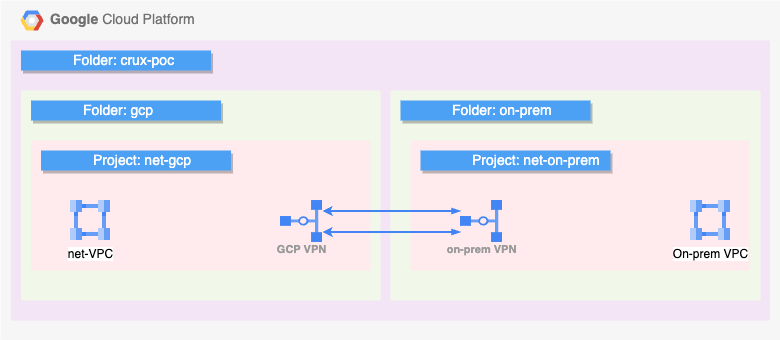

The purpose of this PoC is to showcase the capabilities on GCP Anthos.

## Overview

In order to mimic 2 different environments, 2 different folders have been created. Within each folder, there is a project which hosts a shared VPC and another project that hosts services deployed on the shared VPC.

](resources/folder-struct.drawio.png)

GCP network and On-prem network reside is separate VPC networks. Connectivity between both VPCs is established using Cloud VPN. This is a HA VPN leveraging 2 tunnels and routes are exchanged using the BGP protocol.

In the svc-gcp project, a GKE clusters has been deployed while in the on-prem-svc project, open source kubernetes has been installed on GCE VMs to emulate a bare metal kubernetes cluster. Both clusters are running the same version of kubernetes i.e. 1.27. Both clusters have 2 nodes only.

The architecture diagram below gives a high level over view of the PoC

